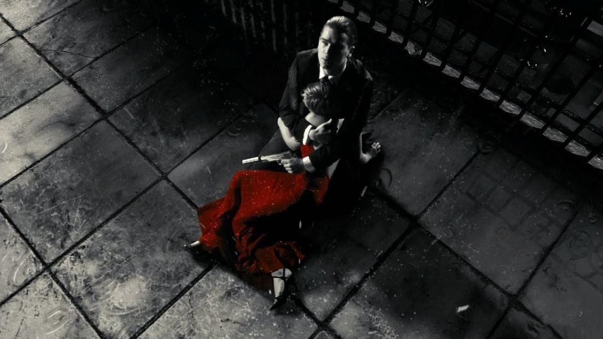
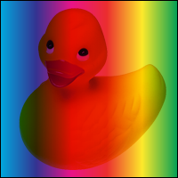
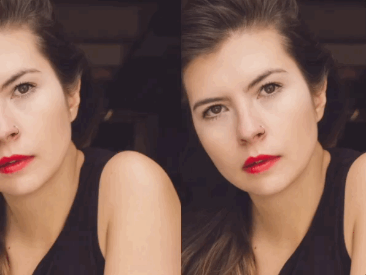
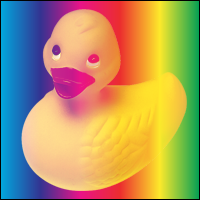
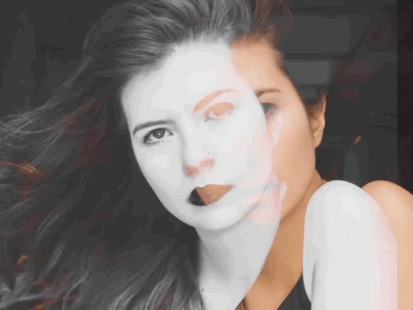

Как-то раз мне пришла в голову идея воссоздать такой эффект выборочного обесцвечивания на CSS:



С художественной точки зрения такой эффект уже давно заезжен, но мне была интересна именно техническая сторона вопроса. То есть задача — обесцветить всю картинку, при этом оставив нетронутым красный цвет.

Вот что получилось в результате экспериментов:


Демо тут https://codepen.io/juwain/pen/mxLJYj.

Как это работает. Сразу стало понятно, что для решения нужно изготовить под конкретную картинку SVG-маску, затем наложить поверх цветной картинки чёрно-белую с вырезанной частью. В итоге, через дырку в чёрно-белом изображении будет просвечивать цветная. Решение с изготовлением маски вручную было отброшено из-за неуниверсальности.

В поисках универсального способа я решил попробовать сделать «маску на лету» из самого же оригинального изображения с помощью режимов наложения (blend modes).

Вкратце про режимы наложения. По умолчанию слои в CSS располагаются друг поверх друга и не «просвечивают»:


А можно сделать так, чтобы слои не просто показывались один над другим, а «смешивались» по определённому алгоритму:



Режимы наложения пришли в CSS из Фотошопа благодаря сотрудникам компании Adobe. Но не все фотошоповские режимы наложения переехали в CSS — всего в CSS есть 16 вариантов смешивания слоёв. Не буду вдаваться в подробности, с режимами наложения можно поиграть тут.

---

Ок, к _селективному обесцвечиванию_.

Сверху на изображение накладывается его же копия с помощью псевдоэлемента:

```css
.photo {
  --source: url(some-url-string);
  /* это нижний слой */
  background-image: var(--source);
}

.photo::after {
  /* это верхний слой */
  background-image: var(--source);
}
```



Дальше у верхнего слоя режим наложения меняется на lighten. При таком режиме тёмные участки начинают «просвечивать», а светлые — наоборот остаются непрозрачными:



Режим наложения между слоями включается свойством `mix-blend-mode`.

```css
.photo::after {
  mix-blend-mode: lighten;
}
```

Получилось то, что нужно: тёмный фон верхнего слоя стал прозрачным, а светлые участки — нет:


Далее верхний слой обесцвечивается с помощью CSS-фильтра:

```css
.photo::after {
  filter: grayscale(1);
}
```

Теперь верхний слой накладывается светлыми обесцвеченными участками на нижнюю цветную фотографию:


Уже почти то, что нужно. Надо теперь сделать светлые участки верхнего слоя более непрозрачными.

В этом снова помогут режимы наложения. Помимо свойства `mix-blend-mode`, «смешивающее» два разных слоя, есть ещё одно свойство, меняющее режим наложения — это `background-blend-mode`. Оно задаёт режим смешивания фоновых элементов одного слоя: изображения, фонового цвета, градиента.

Итак, верхнему слою задаётся серый фоновый цвет и режим смешивания картинки с ним `hard-light`. Это комбинированный режим, он чем-то похож на режим умножения — если коротко, он делает цвета ярче. Применительно в чёрно-белому изображению, этот режим сделает его светлые части более контрастными.

В итоге получается желаемый результат:



---

Остаётся разобраться, какие именно цвета в таком сочетании режимов наложения делаются прозрачными, а какие нет.

Для этого я сделал демо со слоями с полосатыми линейными градиентами, и вот что получилось:


То есть при рассмотренной в этой статье комбинации режимов наложения прозрачными становятся области красного, синего и фиолетового оттенков, а желто-оранжевые, зелёные и голубые оттенки остаются непрозрачными.

Довольно крейзи-фича, которую вряд ли где-то можно заиспользовать, но кайфовая и трюковая, как я люблю.
