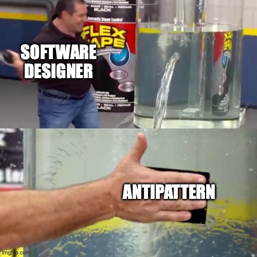

При работе с кодом больше всего времени уходит на его чтение и понимание, а не написание. Код — не только инструкция для компьютера, но и объяснение ваших намерений другим людям. Если написать хаотичный, но работающий код, то другим разработчикам станет труднее понимать его и вносить осмысленные изменения.

## Что такое паттерн?

Паттерны проектирования — общепринятые переиспользуемые шаблонные решения конкретных проблем при создании софта. Они помогают сделать код более упорядоченным, предсказуемым и надёжным и позволяют говорить с другими разработчиками на одном языке. Знание паттернов даёт возможность опираться на опыт прошлых поколений разработчиков, которые уже сталкивались с определёнными проблемами и выработали проверенные временем решения.

Каждый паттерн фокусируется для решения конкретной проблемы, описывает когда и как его можно применять, а также указывает на ограничения использования.

Некоторые паттерны относятся только к JS или React, а часть из них, как структуры данных и алгоритмы, можно реализовать в любом языке программирования.

«Идеального» паттерна не существует. Каждый проект, приложение или программа индивидуальны и поэтому для принятия решения, какой паттерн использовать (или не использовать), нужно оценить, какую выгоду паттерн может дать.

## Преимущества паттернов

- проверенные решения
- могут быть легко переиспользованы
- помогают предотвращать небольшие проблемы пока они разрослись до больших
- обогащают «словарь» разработчиков, делая коммуникацию быстрее

## Что такое антипаттерн?

Антипаттерн, в противоположность паттерну, это плохое решение проблемы, которое может и решать её, но в долгую приводит ухудшению качества кода. Хорошая сторона антипаттера — он явно отвечает на вопрос «как не надо делать». Часто бывает так, что релиз требуется здесь и сейчас, что приводит к появлению временных решений и добавлению «костылей». Если ими злоупотреблять, то накопится большой техдолг, состоящий из антипаттернов, который ухудшает ситуацию по всем фронтам.

### Категории паттернов

«Классические» паттерны (из легендарной книги [Design Patterns: Elements of Reusable Object-Oriented Software](https://www.oreilly.com/library/view/design-patterns-elements/0201633612/)) относятся прежде всего к объектно-ориентированному программированию, их можно разделить на три категории:

1. Порождающие (Creational)
2. Структурные (Structural)
3. Поведенческие (behavioral)

### Порождающие паттерны

Этот вид паттернов фокусируется на механизме создания объектов, порождающие паттерны позволяют контролировать этот процесс. Например:

- объекты создаются одиночно или группами
- при создании объектов производятся дополнительные действия
- объекты создаются другими объектами («фабриками») или отдельными командами объекта-«строителя»

К порождающим относятся паттерны: `Constructor`, `Factory`, `Abstract`, `Prototype`, `Singleton`, `Builder`.

### Структурные паттерны

Специализируются на построении «блоков» из объектов системы.
Например, один объект объединяется с другим в единую структуру или один объект выступает «интерфейсом» к другому.

К структурным паттернам относятся: `Decorator`, `Facade`, `Flyweight`, `Adapter`, `Proxy`.

### Поведенческие паттерны

Направлены на улучшение коммуникации между разрозненными объектами в системе. Например, при изменении состояния одного объекта другой получает уведомление об этом.

К поведенческим паттернам относятся: `Iterator`, `Mediator`, `Observer`, `State`, `Visitor`.

## Паттерны в JS и вокруг него

Так как «классические» паттерны ориентированы прежде всего на объектно-ориентированное программирование, то не все их них могу быть одинаково полезны в контексте JS или React.

А некоторые паттерны были придуманы именно под JS/React. Например, паттерн `Module` — модули встроены в сам язык ES2015, а паттерн `Headless Component` — более фреймворкоспецифичный паттерн, который можно реализовать не только в React, но и в других фреймворках.

Другие паттерны, например, `State Machine` или `Signal` — это логическое развитие «классических» паттернов в современных библиотеках и фреймворках.

Отдельно выделяются паттерны асинхронного программирования `Promise`, `Async/await` специфичные для JS, но присутствующие и в других средах и языках.

Более высокоуровневые, архитектурные паттерны помогают выстраивать вокруг определённой идеи целиком все взаимосвязи и поток данных внутри клиентского или клиент-серверного приложения: например, это паттерны `MVC`, `MVP`, `MVVM`, которые обычно реализуются уже на уровне фреймворков.
