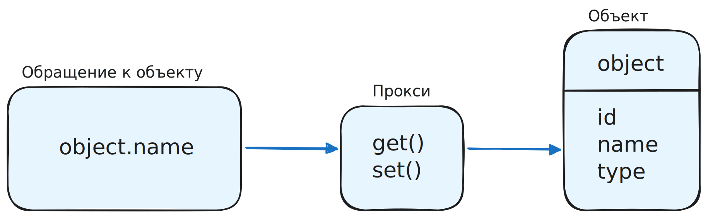

Паттерн Proxy (Прокси) применяется к объектам. Прокси — это специальная прослойка между объектом и тем, кто к нему обращается. Эта прослойка может перехватывать и контролировать все взаимодействия с объектом. То есть появляется возможность базовые операции с объектом (`get`, `set`, `delete`…) дополнить нужной логикой, переопределить или вовсе отменить.

На схеме обращение к объекту проходит не напрямую, а через прокси, который уже в свою очередь может выполнить какое-то дополнительное действие в момент вызова (залогировать, проверить «права доступа», дополнить или скорректировать ответ) и затем уже направить запрос непосредственно к объекту:



В JS паттерн Proxy проще всего реализовать с помощью одноимённого объекта в языке — `Proxy`. Берём обычный объект в JS, создаём для него прокси-объект, получаем возможность перехватывать и дополнять/переопределять операции, совершаемые с объектом:

```js
// Целевой объект
const target = {
  message1: "hello",
  message2: "everyone",
};

// Прокси-объект
const handler = {
  get(target, prop) {
    console.log(`Свойство ${prop} считалось`);
    return target[prop];
  },
  set(target, prop, value) {
    console.log(`Свойству ${prop} задано значение ${value}`);
    target[prop] = value;
    return true;
  },
};

// Proxy принимает в параметрах целевой объект
// и прокси-объект, который будет «перехватывать» вызовы
const proxiedObj = new Proxy(target, handler);

proxiedObj.message1;
// log: Свойство message1 считалось

proxiedObj.message2 = "nobody";
// log: Свойству message2 задано значение nobody
```

Какие юзкейсы есть у `Proxy`:

- логирование операций, осуществляемых с объектом (отправка аналитики, мониторинг действий…)
- валидация, «встроенная» в объект (перед заданием значения свойству проверяем, соответствует ли значение правилам валидации)
- кеширование результатов операций с объектом или вызовов функции (функция — это тоже объект, её также можно «проксировать»)
- сохранение объекта в персистентное хранилище («мидлваря», синхронизирующая состояние объекта при его изменении с состоянием на сервере или в локальном хранилище)

Подробнее разберём пример с проксированием функции. В случае функций через прокси можно перехватывать момент вызова функции (перехватчик `apply`) и, например, манипулировать аргументами до вызова.

```js
const a = () => {
  // функция
};

const b = new Proxy(a, {
  apply: (target, thisArg, argumentsList) => {
    // перехватчик вызова
  },
});
```

До вызова функции мы получаем референс на саму функцию, контекст и массив агрументов и можем с ними делать что угодно перед тем, как непосредственно вызвать (или даже не вызвать) функцию. К примеру, можно организовать кэш, чтобы по переданному набору аргументов запомнить вычисленное значение и при повторном вызове брать его из кэша.

```js
function memoize(target) {
  const cache = new Map();

  return new Proxy(target, {
    apply: (target, thisArg, argumentsList) => {
      const key = JSON.stringify(argumentsList);
      if (cache.has(key)) {
        console.log(`Результат для ${argumentsList} взят из кэша`);
        return cache.get(key);
      } else {
        const result = target.apply(thisArg, argumentsList);
        cache.set(key, result);
        return result;
      }
    },
  });
}

const add = (a, b) => a + b;
const memoizedAdd = memoize(add);

memoizedAdd(3, 7); // Вычисляет и записывает в кэш
memoizedAdd(3, 7); // Берёт результат из кэша
```

Аргументами функции, то есть и ключами в кэше могут быть не только примитивы, но и объекты, за счёт того, что ключ формируется с помощью `JSON.stringify`.

Таким образом, с помощью `Proxy` можно на коленке собрать «мидлвари» для объектов, массивов и функций, в общем-то, с любыми целями.

Но стоит помнить, что добавление «перегрузки» базовым методам объектов имеет свою цену: в зависимости от того кода, который написан внутри «перехватчика», время выполнения операции с объектом неминуемо увеличится. Так что злоупотреблять `Proxy` не стоит.
