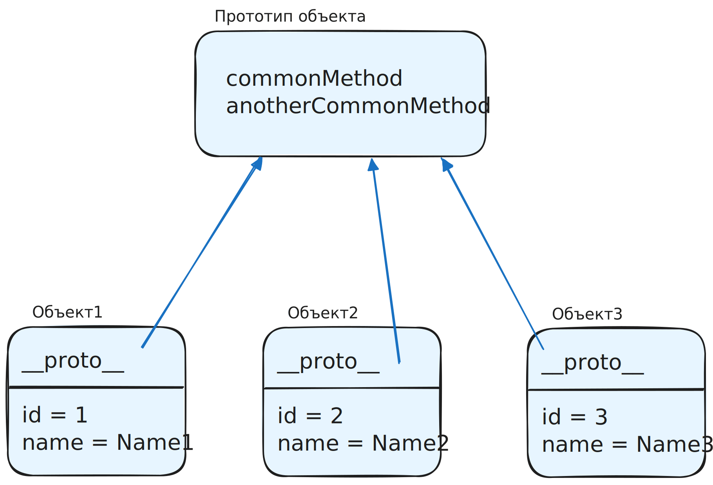

Если <a href="/trainers/design-patterns-js/04-singleton-theory">паттерн Singleton</a> отвечает за создание «единственного и неповторимого» объекта, то паттерн `Prototype` (Прототип), напротив, про создание объектов на основе общего шаблона. То есть если нужно создать много однотипных объектов, не обязательно создавать их все с нуля. Можно взять заготовку, например, с уже готовыми общими функциями:



Паттерн Prototype в JS реализуется через «нативное» прототипное наследование в языке: одни объекты могут выступать прототипами (шаблонами) для других объектов.

Это можно реализовать несколькими способами:

1. Использовать статический метод объекта `Object.create(prototype, optionalDescriptorObjects)`: в параметрах передаётся прототип и описание «собственных» свойств нового объекта:

```js
const objectPrototype = {
  commonMethod() {},
  anotherCommonMethod() {},
};

const object1 = Object.create(objectPrototype, {
  id: {
    value: 1,
    enumerable: true,
  },
  name: {
    value: "Name1",
    enumerable: true,
  },
});

// object1 = {
//   id: 1,
//   name: 'Name1',
//   prototype: {
//     commonMethod() {},
//     anotherCommonMethod() {}
//   }
// }
```

2. Воспользоваться классами (ES2015) для того, чтобы «расшарить» общие методы среди инстансов (под капотом это всё равно сводится к функциям и прототипному наследованию):

```js
class MyClass {
  constructor(id, name) {
    this.id = id;
    this.name = name;
  }
  commonMethod() {}
  anotherCommonMethod() {}
}

const object1 = new MyClass("1", "Name1");

// object1(MyClass) = {
//   id: 1,
//   name: 'Name1',
//   prototype: {
//     commonMethod() {},
//     anotherCommonMethod() {}
//   }
// }
```

Использование «нативного» для JS механизма прототипного наследования заодно благоприятно для перфоманса: функции, объявленные внутри прототипа, не копируются индивидуально в каждый объект, а ссылаются на единственное место в прототипе (то есть занимают меньше места в памяти).
