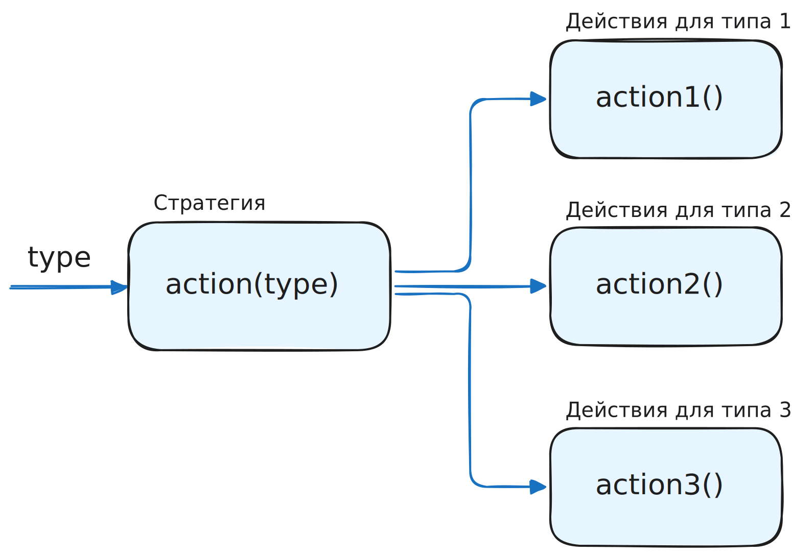

Паттерн Strategy (Стратегия) похож на <a href="/trainers/design-patterns-js/10-factory-theory">паттерн Factory</a> подходом. В Factory в зависимости от поданного на вход параметра создаётся и возвращается объект определённого типа. А в Strategy — выполняется определённый для каждого типа параметра произвольный набор действий.



В самом простом виде Стратегия реализуется через одну «суперкласс»/функцию, включающую в себя все ветки условий:

```js
function formatText(text, formatType) {
  if (formatType === "uppercase") {
    return text.toUpperCase();
  } else if (formatType === "lowercase") {
    return text.toLowerCase();
  } else if (formatType === "capitalize") {
    return text[0].toUpperCase() + text.slice(1).toLowerCase();
  } else {
    throw new Error("Unknown format type");
  }
}

// Использование
console.log(formatText("hello", "uppercase")); // HELLO
console.log(formatText("WORLD", "lowercase")); // world
```

В случае, если «режимов» работы немного и они не меняются, а также если не хочется делать логику программы слишком комплексной, такого подхода достаточно. Но у него есть свои недостатки:

- «развесистое» и растущее ветвление в логике → сложно добавлять новые ветки, без затрагивания остальных
- если ветвей становится много, они перемешиваются и «шарят» логику между собой, становится сложно вычленить, что именно относится к определённой отдельной ветке → при внесении правок в ветку растёт вероятность появления ошибки в соседней (цикломатическая сложность)

Но могут быть дополнительные требования и условия:

- есть «семейство» похожих алгоритмов работы
- нужно менять алгоритм в зависимости от контекста выполнения
- логика ветвления разрастается и логика соседних веток начинает перемешиваться между собой
- нужны разные вариации одного и того же алгоритма

В таком случае не выйдет просто вынести куски кода в отдельные функции, так как взаимосвязи между ними от этого никуда не денутся. Выход — изолировать логику каждой «стратегии» в независимый класс/функцию, где она гарантировано не будет пересекаться с соседней веткой (при этом возможно частичное дублирование логики — это ок в угоду изоляции).

Как будет выглядеть Стратегия с таким подходом:

```js
// Базовый класс стратегии
class TextFormatStrategy {
  format(text) {
    throw new Error("Метод format должен быть переопределен!");
  }
}

// Конкретные стратегии
class UppercaseStrategy extends TextFormatStrategy {
  format(text) {
    return text.toUpperCase();
  }
}

class LowercaseStrategy extends TextFormatStrategy {
  format(text) {
    return text.toLowerCase();
  }
}

class CapitalizeStrategy extends TextFormatStrategy {
  format(text) {
    return text[0].toUpperCase() + text.slice(1).toLowerCase();
  }
}

// Контекст
class TextFormatter {
  constructor(strategy = new UppercaseStrategy()) {
    this.strategy = strategy;
  }

  setStrategy(strategy) {
    this.strategy = strategy;
  }

  formatText(text) {
    return this.strategy.format(text);
  }
}

// Использование
const formatter = new TextFormatter();

formatter.setStrategy(new UppercaseStrategy());
console.log(formatter.formatText("hello")); // HELLO

formatter.setStrategy(new LowercaseStrategy());
console.log(formatter.formatText("WORLD")); // world

formatter.setStrategy(new CapitalizeStrategy());
console.log(formatter.formatText("tExT")); // Text
```

При добавлении новой стратегии, прежние не затрагиваются:

```js
class ReverseStrategy extends TextFormatStrategy {
  format(text) {
    return text.split("").reverse().join("");
  }
}

formatter.setStrategy(new ReverseStrategy());
console.log(formatter.formatText("hello")); // olleh
```

Что получаем с таким подходом:

- каждая стратегия изолирована
- легко добавить новые стратегии без затрагивания существующих
- просто тестировать каждую стратегию независимо от других
- можно подменять стратегии в рантайме
