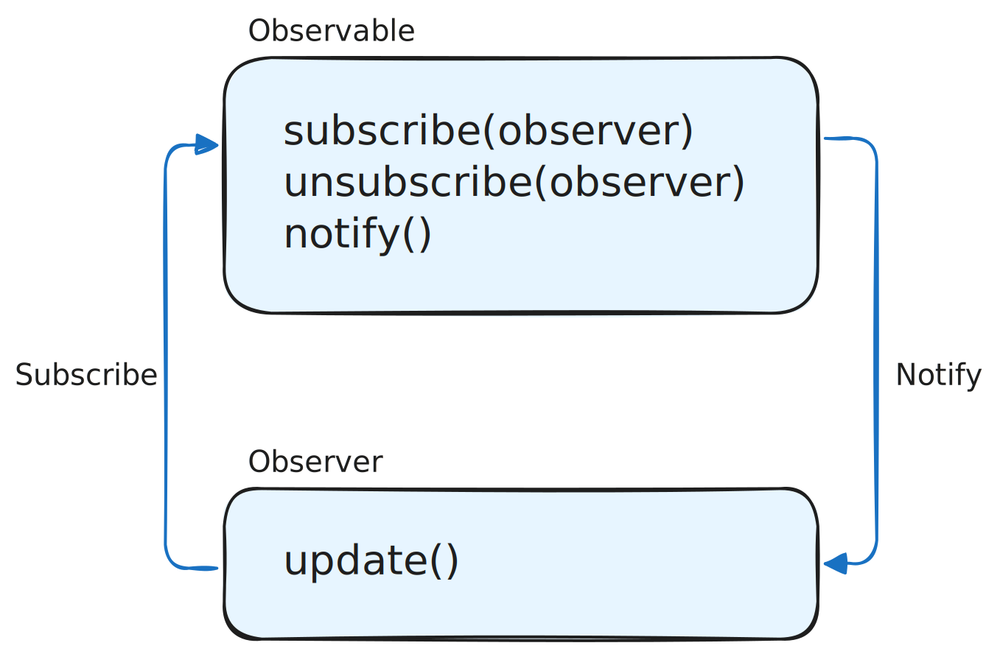
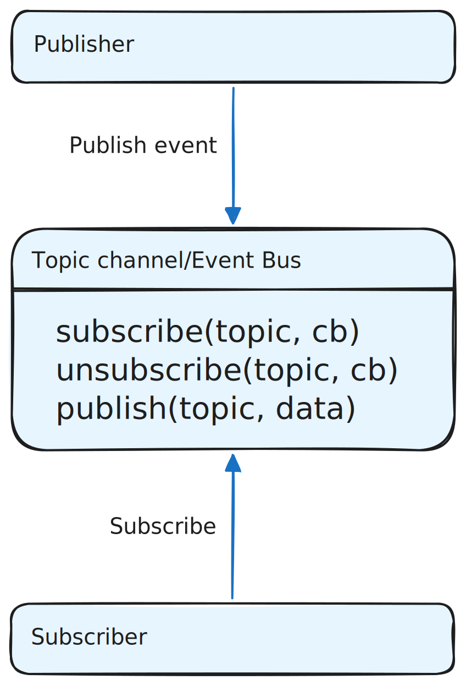

С помощью паттерна `Observer` (Наблюдатель) можно создать связь между несколькими объектами, наблюдаемым и наблюдателями, и оповещать наблюдателей при изменении в наблюдаемом объекте. Наблюдаемый объект содержит внутри себя и управляет списоком всех своих наблюдателей.

Такой подход часто используется в современных фреймворках, чтобы оповестить компоненты об изменении их состояния.

Основная фишка подхода в том, что наблюдаемый объект в нужный момент оповещает автоматически сразу всех наблюдателей и при необходимости передаёт им в оповещении дополнительные данные.

Если какой-то из наблюдателей больше не нуждается в получении уведомлений от наблюдаемого, он может «отписаться» и удаляется из списка наблюдателей.



Представьте, что есть объект, за которым нужно следить. Назовём его Observable (иногда такой объект ещё называют Subject). Как уже было сказано ранее, наблюдаемый объект содержит список всех своих наблюдателей, может добавлять или убирать их из списка, а также оповещать всех наблюдателей в нужный момент:

```js
class Observable {
  constructor() {
    // список всех наблюдателей
    this.observers = [];
  }

  // добавление наблюдателя в список
  subscribe(observer) {
    this.observers.push(observer);
  }

  // удаление наблюдателя из списка
  unsubscribe(observer) {
    this.observers = this.observers.filter((obs) => obs !== observer);
  }

  // вызов метода update у всех наблюдателей из списка
  notify(data) {
    this.observers.forEach((observer) => observer.update(data));
  }
}
```

Как вы заметили, оповещение наблюдателей `observer` происходит путём вызова метода `update`. То есть у каждого наблюдателя должен быть имплементирован этот метод, опционально принимающий параметры и выполняющий нужные действия.

```js
class Observer {
  update(data) {
    console.log(`Наблюдатель получил данные: ${data}`);
  }
}
```

Как это будет работать:

```js
// наблюдаемый
const observable = new Observable();

// наблюдатель
const observer = new Observer();

// подписка наблюдателя на уведомления
observable.subscribe(observer);

// отправка уведомления наблюдателю
observable.notify("Привет, Наблюдатель!");

// отписка наблюдателя от уведомлений
observable.unsubscribe(observer);

// отправка уведомления наблюдателю,
// наблюдатель уже не получит его,
// так как отписан от уведомлений
observable.notify("Пока!");
```

Похожий паттерн заложен в сам язык ECMAScript (природа языка в целом событийная):

```js
const button = document.querySelector(".button");
const handler = () => {};

// так подписываемся на событие
button.addEventListener("click", handler);

// так отписываемся
button.removeEventListener("click", handler);

// под капотом button emit-тит событие 'click',
// по которому запускается обработчик
button.click();
```

Оба этих подхода хоть и довольно широко распространены, но у них обоих есть существенный недостаток: «наблюдаемый ←→ наблюдатель» или «объект ←→ обработчик» всё ещё тесно связаны друг с другом, то есть нужно в каком-то месте программы явно логически объединить две сущности воедино, чтобы это заработало.

Чтобы совсем их отвязать друг от друга, можно использовать похожий на `Observer` паттерн `Publish/Subscribe` (Публикация/Подписка) или сокращённо `Pub/Sub`. В этом паттерне между объектами, желающими получать уведомления (subscribers), и объектом эти уведомления отправляющим (publisher), есть специальный топик-канал или шина событий. Причём эта шина может быть как локальной между двумя модулями, так и глобальной на всё приложение.

Publisher отправляет события в канал и не знает ничего о том, кто и когда эти события получит. Subscribers слушают определённое событие и ничего не знают о том, кто и когда эти события отправит.
Такая событийная система позволяет передавать данные между модулями системы, не увеличивая её связность:



Вот как это может быть реализовано в коде:

```js
class PubSub {
  constructor() {
    this.topics = {}; // { topic: [callback1, callback2...] }
  }

  // подписка на событие
  subscribe(topic, callback) {
    this.topics[topic] = this.topics[topic] || [];
    this.topics[topic].push(callback);
  }

  // отписка от события
  unsubscribe(topic, callback) {
    if (this.topics[topic]) {
      this.topics[topic] = this.topics[topic].filter((cb) => cb !== callback);
    }
  }

  // публикация события
  publish(topic, data) {
    if (this.topics[topic]) {
      this.topics[topic].forEach((cb) => cb(data));
    }
  }
}

// пример использования
const bus = new PubSub();

// подписка
const newsHandler = (data) => console.log("Новость:", data);
bus.subscribe("news", newsHandler);

// публикация
bus.publish("news", "кое-что случилось"); // Выведет: "Новость: кое-что случилось"

// отписка
bus.unsubscribe("news", newsHandler);

bus.publish("news", "этого никто не увидит"); // Ничего не выведет
```

Реализация напоминает то, как работает `addEventListener`/`removeEventListener` с одним исключением: подписка происходит не на конкретный объект, а на общесистемную шину событий, что убирает связность между конкретными объектами.

Слабая связность — простой и мощный эффект от применения паттерна `Pub/Sub`. Но одновременно это может быть и слабой его стороной, так как иногда может происходить ситуация, в которой нет железобетонной гарантии, что разрозненные части системы функционируют слаженно. Например, publishers могут ожидать, что один или несколько subscribers слушают их сообщения. А если по каким-либо причинам один из subscribers перестанет функционировать, то и принимать сообщения от publishers он перестанет, что можно не заметить сразу.
