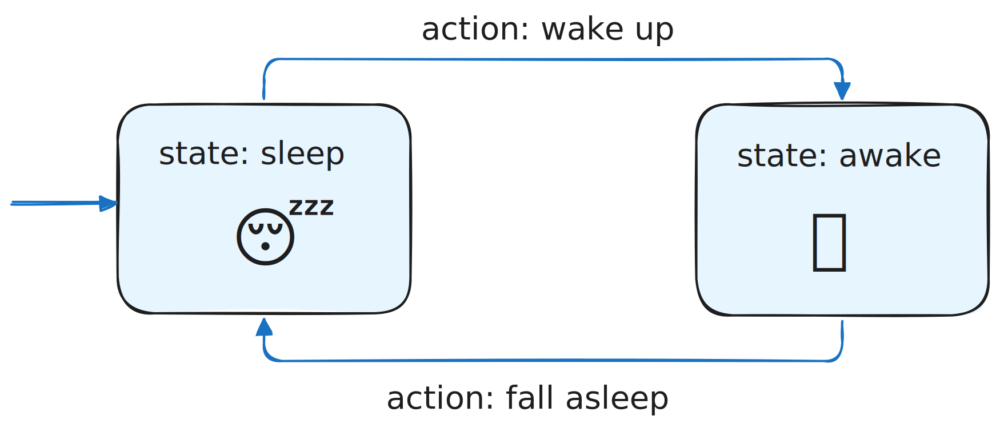
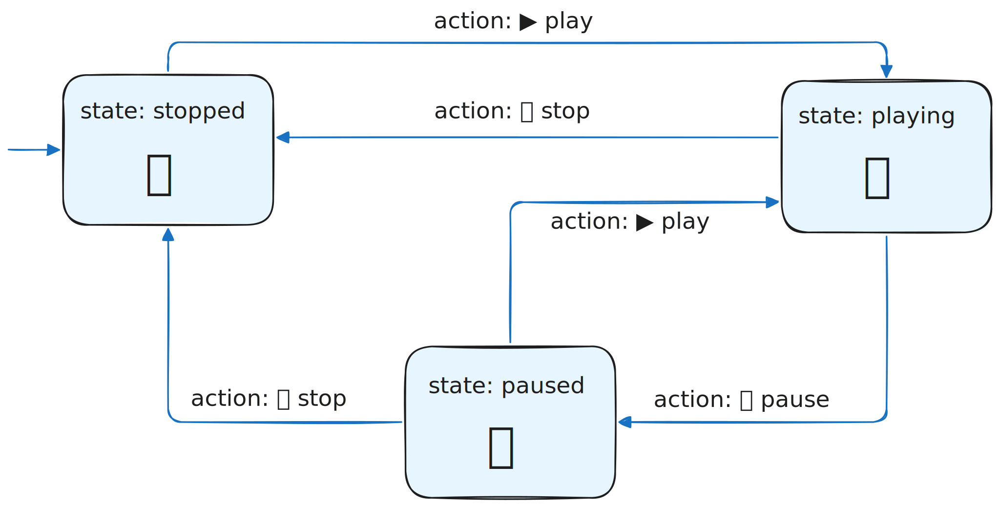

В <a href="/trainers/design-patterns-js/12-strategy-theory">паттерне Strategy</a> в зависимости от поданного в класс/функцию параметра выполнялись разные варианты действий. По сути это задание «режима» или стратегии работы программы, когда в одном режиме она выполняет одно действие, а в другом — другое.

Паттерн `State` — тоже про внутренние «режимы работы» программы. Но в отличие от Стратегии, паттерн `State` фокусируется прежде всего на состояниях системы и переходах между ними, нежели на выполнении конкретных алгоритмов. По сути основной алгоритм работы в `State` и есть переключение состояния системы из одного в другое по определённым правилам.

В самом простом случае система может состоять из двух состояний: выключено → включено. Чтобы перейти из одного состояния в другое вызывается определённое действие (action). Например, человек «спит» → вызывается action «пробудиться» → человек «бодрствует».



Откуда взялся такой подход, и чем он может быть полезен. Вообще, когда создаётся некая система, обычно естественно думать прежде всего о том, что эта система будет делать, какие выполнять действия, что она поможет достичь.

Такой подход хорошо работает на прямолинейных сценариях с несложной логикой. В случае системы со сложным поведением, если её спроектировать исходя из действий, то тогда в программе начнут появляться «режимы», «флаги» isSomething… и хитросплетения условий с комбинациями значений этих флагов.

Возьмём для примера систему, способную пребывать в трёх состояниях: `stopped`, `playing` и `paused` (простейший плеер). Помимо трёх состояний в системе можно выполнить три действия: `play`, `pause` и `stop`. Кроме того, явно обозначены правила перехода между состояниями с помощью действий:



- состояние `stopped` → действие `play` → состояние `playing`
- состояние `playing` → действие `pause` → состояние `paused`
- состояние `playing` → действие `stop` → состояние `stopped`
- состояние `paused` → действие `play` → состояние `playing`
- состояние `paused` → действие `stop` → состояние `stopped`

Вот как будет выглядеть пример на `if`-ах:

```js
let playerState = "stopped";

function handlePlayerAction(action) {
  if (playerState === "stopped") {
    if (action === "play") {
      console.log("Запуск воспроизведения");
      playerState = "playing";
    }
  } else if (playerState === "playing") {
    if (action === "pause") {
      console.log("Пауза");
      playerState = "paused";
    } else if (action === "stop") {
      console.log("Остановка");
      playerState = "stopped";
    }
  } else if (playerState === "paused") {
    if (action === "play") {
      console.log("Продолжение воспроизведения");
      playerState = "playing";
    } else if (action === "stop") {
      console.log("Остановка с паузы");
      playerState = "stopped";
    }
  }
}
```

Если подобных ветвлений и состояний появляется более 8-10, то тогда становится сложно держать в голове ментальную модель, код на флагах и `if`-ах превращается в плохо структурированную кашу, в которой легко допустить ошибку или логическую дыру.

В этом случае как раз и приходит на помощь проектирование системы исходя из её состояний и переходов между ними, а не из выполняемых функций. В каждом состоянии (поле объекта) есть функции-действия, которые возвращают имя нового состояния:

```js
const playerStates = {
  stopped: {
    play() {
      return "playing";
    },
    pause: null,
    stop: null,
  },
  playing: {
    pause() {
      return "paused";
    },
    stop() {
      return "stopped";
    },
  },
  paused: {
    play() {
      return "playing";
    },
    stop() {
      return "stopped";
    },
  },
};

let currentState = "stopped";

function handlePlayerAction(action) {
  const stateHandler = playerStates[currentState][action];

  if (!stateHandler) {
    console.log("Действие невозможно в текущем состоянии");
    return;
  }

  currentState = stateHandler();
}

// Начальное состояние: stopped
handlePlayerAction("play"); // Запуск воспроизведения → playing
handlePlayerAction("pause"); // Пауза → paused
handlePlayerAction("play"); // Продолжение → playing
handlePlayerAction("stop"); // Остановка → stopped
```

Получившаяся система называется `State Machine` (конечный автомат), то есть система с конечным числом состояний и чёткими правилами перехода между ними.
